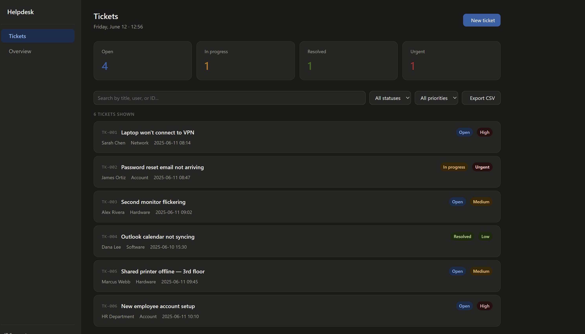

# Helpdesk Ticketing Dashboard

A browser-based IT helpdesk ticketing system built to simulate real-world help desk workflows. Designed as a portfolio project demonstrating front-end development skills relevant to IT support and systems administration roles.

**[Live Demo →](https://cnoce0.github.io/helpdesk-dashboard)**

---

## Features

- **Create tickets** with title, submitter, category, priority, and description
- **Ticket lifecycle management** — move tickets through Open → In Progress → Resolved → Closed
- **Activity log** on each ticket tracks every status change and technician note
- **Search and filter** by status, priority, or keyword
- **Overview dashboard** with charts showing ticket volume by status, category, and priority
- **Export to CSV** for reporting and record-keeping
- Responsive layout, supports dark mode automatically

## Screenshots

> *(Add screenshots here once deployed — open the app, take a screenshot, save as `screenshot.png` in this folder, then uncomment the line below)*

<!--  -->

## Tech Stack

- Vanilla HTML, CSS, JavaScript — no frameworks or dependencies
- [Tabler Icons](https://tabler-icons.io/) for UI icons
- Designed for GitHub Pages deployment (single file, no build step)

## Running Locally

No install needed. Just open `index.html` in any browser.

```
git clone https://github.com/cnoce0/helpdesk-dashboard.git
cd helpdesk-dashboard
# Open index.html in your browser
```

## Planned Improvements

- [ ] SQLite backend to persist tickets across sessions
- [ ] User authentication (technician login)
- [ ] Ticket assignment to specific agents
- [ ] Data visualizations using Chart.js
- [ ] Search across activity log history

## About

Built by Cameron Noce as part of a portfolio focused on IT support and systems work. Studying Computer Science with a Data Science minor at Ithaca College, graduating December 2026.
